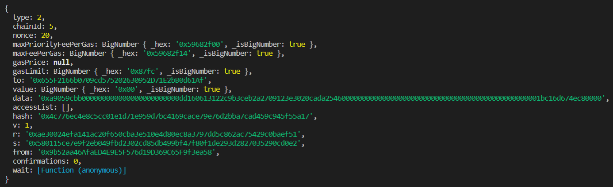

# Objective

- We have 2 EOA accounts, 0xmain and 0xspecific.
- All the assets (ETH and ERC20s) transferred from 0xspecific are bridged to Polygon chain by 0xmain.
- If any other address sends any asset to 0xmain, it is transferred to 0xspecific.

# Logics

- The main function of the script is executed in recursive intervals of 5mins using node cron-job. This cron-job is kept running in an EC2 instance of AWS.
   

- Main steps:
  - ETH payBacks: Get information of ETH amounts that were received in last 5 mins from other addresses (except 0xspecific)
    - Only amounts greater than 0.0002 ETH are included in payBacks.
    - Before sending amounts to 0xspecific, gas fees are deducted to maintain 0xmain ETH balance.
  - ERC20 payBacks: Get information of ERC20 amounts that were received in last 5 mins from other addresses (except 0xspecific)
    - Check current ETH balance for 0xmain
    - Execute ERC20 transfer only if ETH balance > 0.0005. This is done to avoid transaction failing (leading to script crashing) during cron-job.
    - If payBacks are not transferred, they are bridged to Polygon when 0xmain ETH balance increases.
  - Bridging ERC20: Bridge all ERC20s contained (in 0xmain) to Polygon
    - Check current ETH balance for 0xmain
    - Execute ERC20 bridging only if ETH balance > 0.0005. This is done to avoid transaction failing (leading to script crashing) during cron-job.
  - Bridging ETH: Bridge all ETH above minimum balance amount
    - Check current ETH balance for 0xmain.
    - Execute ETH bridging only if ETH balance > minimumBalance (where minimumBalance = 0.005 ETH)

# About Code

- To interact with Polygon PoS bridge we need PoSClient. In posClient.js this is configured
- The config.js contains all information used in the main scripts, like rpc, token addresses, user addresses, private key, etc
- helper.js contain all major logics:
  - `depositETH`, to bridge ETH using PoS
  - `approveERC20`, to approve ERC20 for bridging
  - `depositERC20`, to bridge ERC20 using PoS
  - `calculateBlockNum`, to know the block number before 5 mins (from current block number)
  - `txnHistory`, get all ETH transactions for 0xmain in last 5 mins
  - `knowPayBacks`, query the data received from `txnHistory` and include amounts greater than 0.0002 ETH
  - `erc20TxnHistory`, get all ERC20 transactions for 0xmain in last 5 mins
  - `erc20KnowPayBacks`, query data received from `erc20TxnHistory`
  - `sendETH`, send ETH transaction
  - `sendERC20`, transfer ERC20 tokens
- depositTxn.js contains the main script function:
  - `execute`:
    - Variables:
      - PoS client pointer `client`
      - minimum balance allowed for 0xmain `minBalanceETH`
      - block number before 5 mins `block` and current block number `currentBlock`
      - ETH payBacks in last 5 mins `latestPayBack`
      - ERC20 payBacks in last 5 mins `latestERC20PayBack`
    - Section I: send all payBack amounts to 0xspecific
    - Section II: If 0xmain ETH balance > 0.0005, transfer all ERC20 paybacks to 0xspecific
    - Section III: If 0xmain ETH balance > 0.0005, bridge all ERC20 from 0xmain to Polygon chain
    - Section IV: If 0xmain ETH balance > 0.005, bridge (ETH balance - 0.005) ETH from 0xmain Polygon chain

# How to test

- The script is currently running for Goerli-Mumbai
- 0xmain = `0x9b52aa46AfaED4E9E5F576d19D369C65F9f3ea58`
- 0xspecific = `0xdd160613122C9b3ceb2a2709123e3020CaDa2546`
- If you transfer ETH (>0.0002) to 0xmain, after 5+ mins you can see the ETH balance of 0xspecific increased. Same with ERC20s if 0xmain ETH balance > 0.0005
   
  Note: PoS bridge allows only <strong>PoS-WETH</strong> and <strong>DummyERC20Token</strong> for Goerli-Mumbai bridging. Any other ERC20 won't be bridged.

## Transaction hashs:

- ERC20 PayBacks
   
  hash: 0x4c776ec4e8c5cc01e1d71e959d7bc4169cace79e76d2bba7cad459c945f55a17
  

- ERC20 Bridging
   
  Approve ERC20 txHash = 0x05cb4bc2edd10df30745dbf3d97fc8c4b5da1f8b9a6cdb0fed7ba3756a63323b
   
  Deposit ERC20 txHash = 0x7257504d85bed8ac9c049dbae14ac6d6574ec738f1b244cdf55d784631439bd2
  

- ETH Bridging
   
  Deposit ETH txHash = 0x5be8c7291736de888d5dc5377f34475966841ad665a5b9737547e00cfe5a140d
  

- ETH PayBacks
   
  transactionHash: 0x1e002f748112bb0b97f46e5e50964c5fc6fe8cda7d85f7fd9219d1a4698e2c90
  
